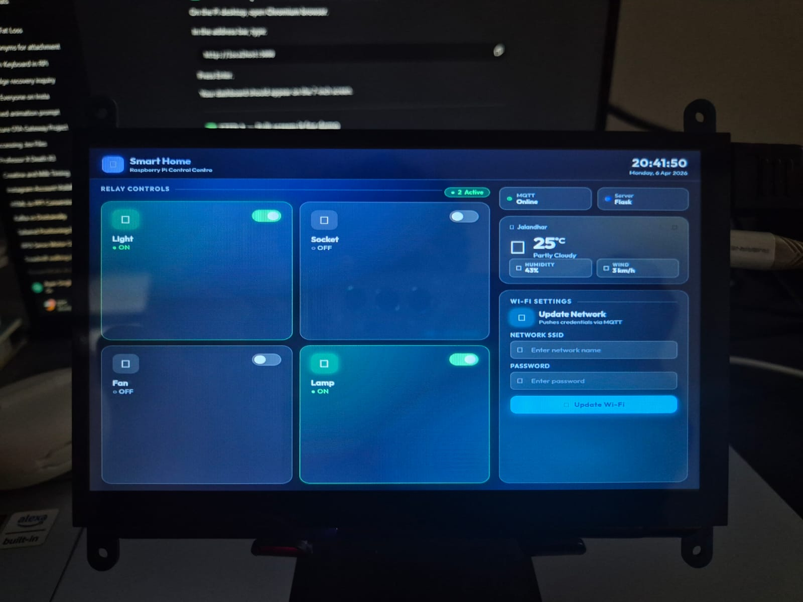

# smart-home-dashboard-mqtt
MQTT based smart home control dashboard using Raspberry Pi and ESP32

## Dashboard Preview

# MQTT-Based Smart Home Control Dashboard using Raspberry Pi and ESP32

This project is a smart home automation dashboard developed using **Raspberry Pi 5**, **ESP32**, **MQTT protocol**, and **Flask**.  
It provides a touchscreen-friendly control interface for managing multiple electrical appliances such as lights and fans through a **4-channel relay module**.

The Raspberry Pi acts as the **central control unit and MQTT broker**, hosting a web-based dashboard that can be displayed on a **7-inch screen**.  
The ESP32 wirelessly communicates with the Raspberry Pi over Wi-Fi using the **MQTT publish-subscribe protocol** and controls the connected relays in real time.

## Features
- Real-time **4 relay control**
- Interactive **Flask dashboard UI**
- **Color-changing toggle buttons**
- MQTT-based communication
- Raspberry Pi hosted **local broker**
- ESP32 wireless actuator control
- Wi-Fi credential update support
- 7-inch touchscreen compatible UI
- Scalable architecture for multiple ESP nodes

## Technologies Used
- Raspberry Pi 5
- ESP32
- Flask
- MQTT (Mosquitto)
- Python
- HTML / CSS
- Arduino C++

## Future Scope
- Voice assistant integration
- Mobile app control
- Sensor dashboard
- Multi-room automation
- CAN bus / industrial communication support
